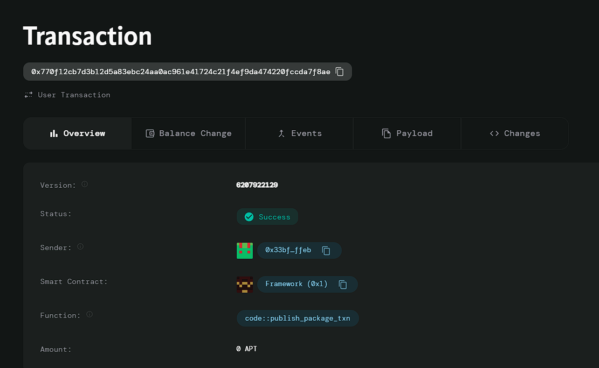

# Blockchain-based Certificate Verification

# Deployed ID: 0x770f12cb7d3b12d5a83ebc24aa0ac961e41724c21f4ef9da474220fccda7f8ae

## Project Description
The **Blockchain-based Certificate Verification** system allows institutions to securely issue certificates (e.g., diplomas, professional credentials) that can be easily verified by anyone on the blockchain. This eliminates the need for manual verification and prevents fraud by ensuring that certificates cannot be tampered with.

## Project Vision
The vision of this project is to provide a decentralized solution for issuing and verifying certificates, making credential verification more efficient, secure, and transparent. This solution can be applied to a wide range of certificate types, including academic degrees, professional qualifications, and more.

## Key Features
- **Certificate Issuance**: Institutions can issue certificates to individuals with secure details stored on the blockchain.
- **Certificate Verification**: Anyone can verify the authenticity of a certificate by querying its certificate ID.
- **Prevent Fraud**: By storing certificates on the blockchain, the system prevents forgery and ensures that certificates cannot be altered after issuance.
- **Transparency**: All issued certificates are publicly verifiable, providing transparency and trust in credentialing.

